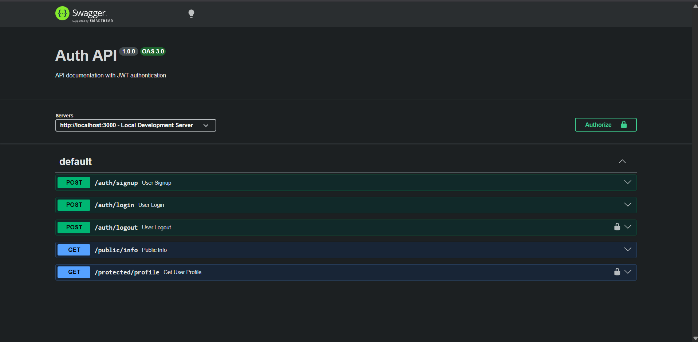

# BE-4 Auth API & Swagger UI

Interactive API documentation and authentication service built with Express, Supabase Auth, and Swagger UI.



---

## 🔒 Authentication & Security

This API uses **JWT Bearer Token** authentication configured via OpenAPI 3.0 specification (`openapi.json`) and served via `swagger-ui-express`.

### OpenAPI Security Scheme Configuration
```json
"components": {
  "securitySchemes": {
    "bearerAuth": {
      "type": "http",
      "scheme": "bearer",
      "bearerFormat": "JWT"
    }
  }
}
```

Protected routes require the `bearerAuth` security requirement:
```json
"security": [
  {
    "bearerAuth": []
  }
]
```

---

## 🚀 Interactive API Docs (Swagger UI)

Access interactive documentation at:
**[http://localhost:3000/docs](http://localhost:3000/docs)**

### Testing Protected Routes in Swagger:
1. Open `http://localhost:3000/docs` in your browser.
2. Register or Log in using `POST /auth/login` to obtain an `access_token`.
3. Click the **Authorize 🔓** button at the top right of the Swagger UI.
4. Paste your JWT access token and click **Authorize**.
5. Lock icons (🔒) next to protected endpoints (`/protected/profile` and `/auth/logout`) will show as locked.
6. Execute requests on protected endpoints directly from your browser with full authentication!

---

## 📌 API Endpoints Summary

| Endpoint | Method | Security | Description |
|---|---|---|---|
| `/auth/signup` | `POST` | Public | Register a new user |
| `/auth/login` | `POST` | Public | Authenticate user & get JWT tokens |
| `/auth/logout` | `POST` | 🔒 Protected | Log out current user |
| `/public/info` | `GET` | Public | Public welcome information |
| `/protected/profile` | `GET` | 🔒 Protected | Fetch authenticated user profile |

---

## 🛠️ How to Run

1. Install dependencies:
   ```bash
   npm install
   ```

2. Start server:
   ```bash
   npm run server
   # or node server.js
   ```

3. Open Swagger UI in browser:
   `http://localhost:3000/docs`